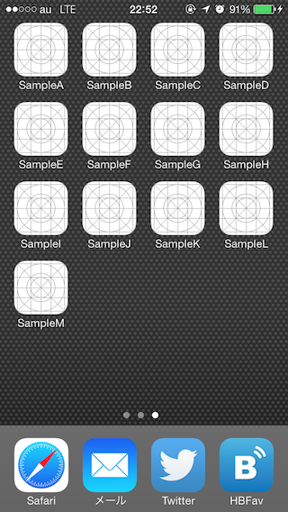
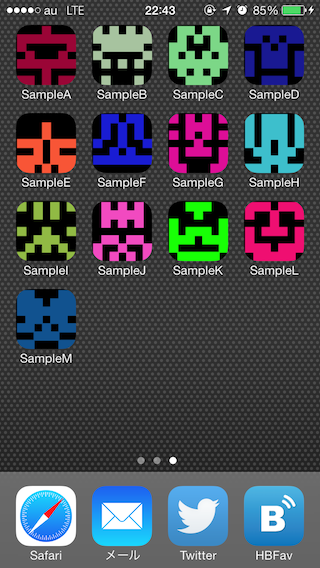

# Picon [](https://travis-ci.org/naoty/picon)

This gem generates [identicons](http://en.wikipedia.org/wiki/Identicon) for iOS apps. It is helpful for developers who cannot create icons with tools such as Adobe Illustrator. Apps under development are usually have the save default icon, and so cannot be tell apart at a glance. However, apps with identicons generated by this gem are can be identified by their icons.

<div>

<span />

</div>

## Requirements

- Xcode 5.0 or later

## Installation

```sh
$ gem install picon
```

## Usage

At the root of Xcode project,

```sh
$ picon generate
```

this command generates identicons for each resolutions, and places them at right place in your project.

## Contributing

1. Fork it
2. Create your feature branch (`git checkout -b my-new-feature`)
3. Commit your changes (`git commit -am 'Add some feature'`)
4. Push to the branch (`git push origin my-new-feature`)
5. Create new Pull Request
